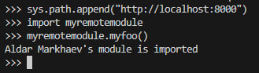

# Лабораторная работа 1. Реализация удаленного импорта
Разместите представленный ниже код локально на компьютере и реализуйте механизм удаленного импорта. Продемонстрируйте в виде скринкаста или в текстовом отчете с несколькими скриншотами работу удаленного импорта.
##

По шагам:

1. Создайте файл myremotemodule.py, который будет импортироваться, разместите его в каталоге, который далее будет "корнем сервера" (допустим, создайте его в папке rootserver).
2. Разместите в нём следующий код:
```
def myfoo():
    author = "" # Здесь обознаться своё имя (авторство модуля)
    print(f"{author}'s module is imported")
```
3. Создайте файл Python с содержимым функций url_hook и классов URLLoader, URLFinder из текста конспекта лекции со всеми необходимыми библиотеками (допустим, activation_script.py).
4. Далее, чтобы продемонстрировать работу импорта из удаленного каталога, мы должны запустить сервер http так, чтобы наш желаемый для импорта модуль "лежал" на сервере (например, в корневой директории сервера). Откроем каталог rootserver с файлом myremotemodule.py и запустим там сервер:
```
python -m http.server
```


5. После этого мы запускаем файл, в котором содержится код, размещенный выше (обязательно добавление в sys.path_hooks).
```
python -i activation_script.py
```
6. Теперь, если мы попытаемся импортировать файл myremotemodule.py, в котором размещена наша функция myfoo будет выведен ModuleNotFoundError: No module named 'myremotemodule', потому что такого модуля пока у нас нет (транслятор про него ничего не знает).
7. Однако, как только мы выполним код:
```
sys.path.append("http://localhost:8000")
```
добавив путь, где располагается модуль, в sys.path, будет срабатывать наш "кастомный" URLLoader. В path_hooks будет содержатся наша функция url_hook.

8.Протестируйте работу удаленного импорта, используя в качестве источника модуля другие "хостинги" (например, repl.it, github pages, beget, sprinthost).
9.Переписать содержимое функции url_hook, класса URLLoader с помощью модуля requests (см. комменты).

